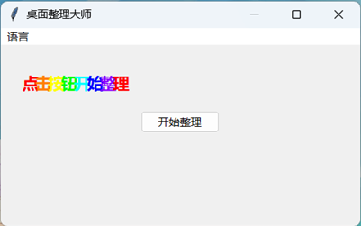
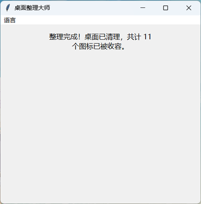
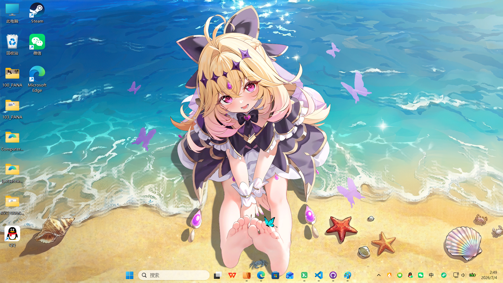
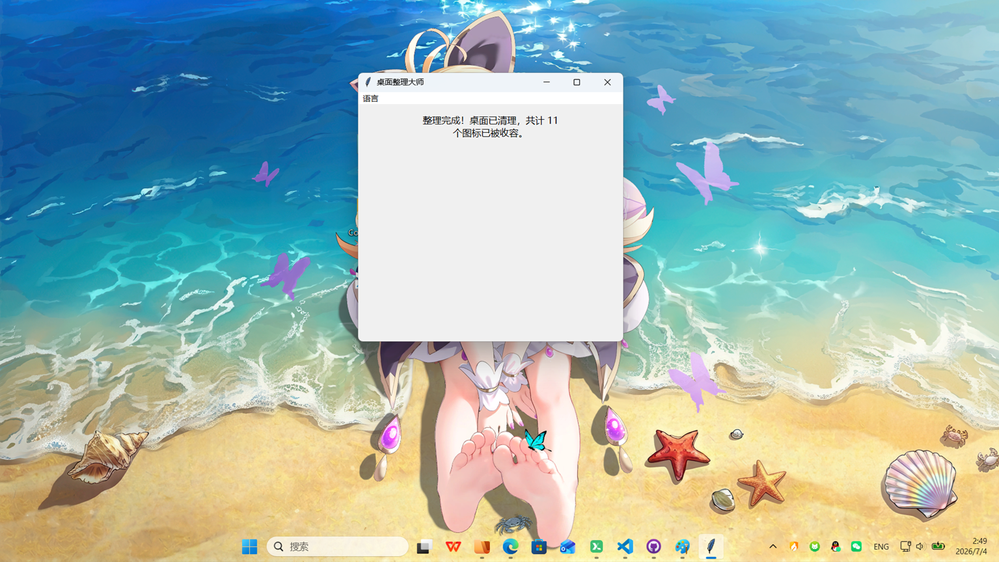

[English](README_en.md)

# 桌面整理大师

一个整蛊软件。点一下按钮，进度条滚几秒，然后你桌面上所有图标就没了——它们被整齐地塞到窗口底下，找不到了。

## 截图

| 开始界面 | 整理中 |
|---------|--------|
|  |  |

| 整理前桌面 | 整理后桌面 |
|-----------|-----------|
|  |  |

## 它能干什么

打开窗口，标题是一行彩虹色的"点击按钮开始整理"。点下去，进度条跑 4 到 7 秒，依次闪过"准备开始整理"、"正在分析桌面"、"调用homo银梦大模型"、"整理完成"。然后窗口缩成刚好盖住图标的大小，图标全在底下藏着。

窗口会死赖在最上层，最小化没用（会弹回来）。关掉软件？图标不还原。你自己拖。

中间还发现桌面开了"自动排列图标"的话，会先弹窗让你关掉。

菜单栏可以切中英文。

## 怎么跑

### 直接运行

```bash
python desktop_tidy.py
```

### 打包为 .exe

```bash
pip install pyinstaller
pyinstaller --onefile --windowed --icon=images/app_icon.ico desktop_tidy.py
```

生成的 `dist/desktop_tidy.exe` 可直接在 Windows 上双击运行，无需安装 Python。

## 运行环境

- Windows 10 / 11
- Python 3.10+（直接运行时需要）
- 零第三方依赖，全部使用 Python 标准库

## 免责声明

这软件真的会移动你的桌面图标，而且不会在退出时复原。别在重要工作的时候打开，除非你知道自己在干嘛。

## License

[MIT](https://github.com/OrangeNekoo/desktop-tidy/blob/main/LICENSE)
